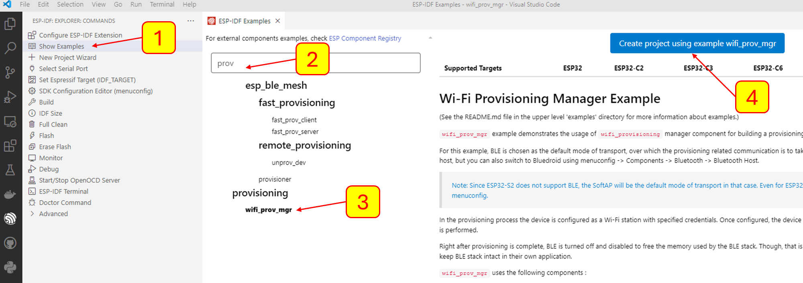

# การทดลองย่อยที่ 1
## 1. สร้าง project บน ESP32

### เปิด vscode

1. ใน esp extension คลิกเมนู `show example`
2. search คำว่า `prov`
3. เลือก `wifi_prov_mgr`
4. create project using example  wifi_prov_mgr

5. build โปรแกรม
6. flash โปรแกรมลง ESP32
7. เปิด serial monitor

#### สังเกตุใน serialport terminal จะเห็น QRCODE

## 2. ติดตั้ง application บน smartphone

8. ค้นหาและติดตั้ง application `ESP BLE Provisioning` บน play store หรือ  `ESP SoftAP Provisioning` ใน app store
9. ใช้ application เพื่อเลือก ssid และป้อน password ให้กับ esp32

#### สังเกตุและบันทึกข้อความที่ esp32 แสดงออกมาทาง serial terminal ไว้ในไฟล์ output_wifi_prov_mgr_sect_1.md เพื่อส่งขึ้น github

