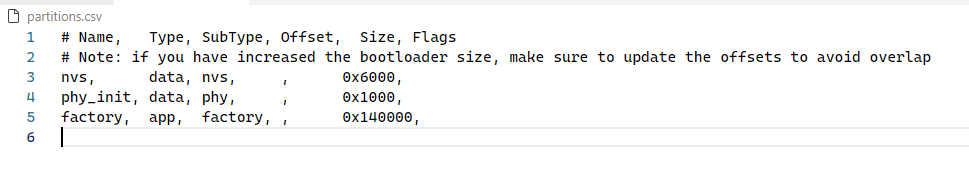
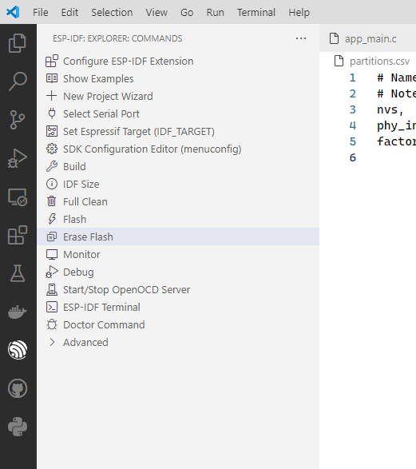
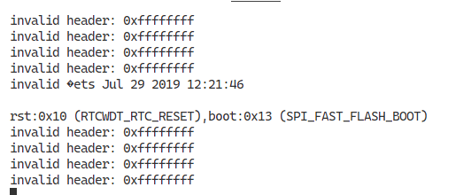
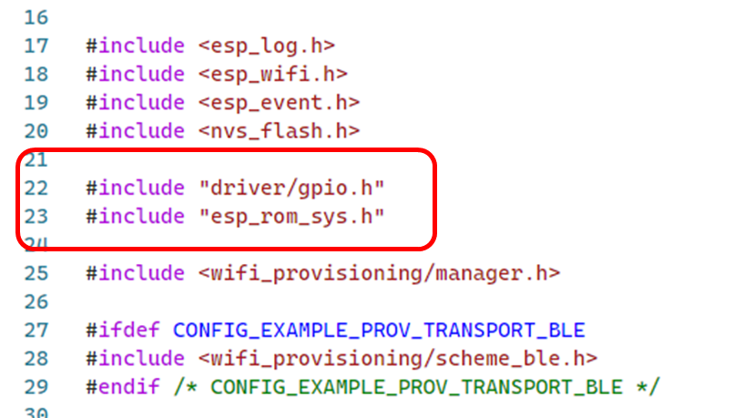
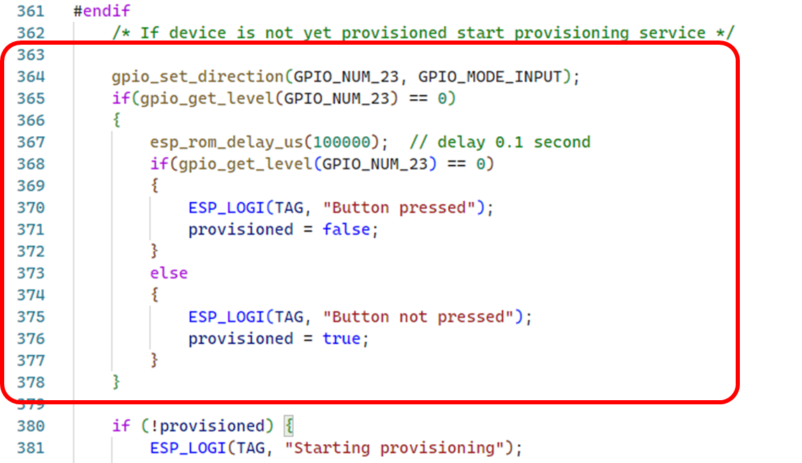

# การทดลองย่อยที่ 2

## 2.1 การล้างข้อมูลการเชื่อมต่อกับ wifi access point

หากต้องการเชื่อมต่อไปยัง wifi access point ตัวอื่น เราต้องทำการล้างข้อมูลสำหรับการ login เดิมออกไปก่อน ซึ่ง ESP32 จะเก็บข้อมูลการ login ไว้ใน flash memory ซึ่งได้จัดการตามเนื้อหาในไฟล์ `partitions.csv` ดังตัวอย่าง

เราต้องทำการล้างข้อมูลการเชื่อมต่อออกจาก flash memory แต่เครื่องมือของ esp32 ไม่อนุญาตให้ลบเฉพาะบาง partion ทำให้เราต้องลบทั้งหมด แล้วค่อย flash ลงไปใหม่ 

โดยการเลือก esp-idf extension แล้วคลิก `Erash Flash`

เมื่อสังเกตใน serialport terminal จะพบข้อความดังนี้

ซึ่งหมายความว่าข้อมูลใน flash ถูกล้างออกทั้งหมด (เหมือนการ format harddisk บนคอมพิวเตอร์)

ให้ทำการ flash โปรแกรมลงไปใน esp32 อีกครั้ง และทำ provision กับ wifi station ใหม่ให้เรียบร้อย

## 2.2 การสร้างปุ่ม provision แทนการล้าง flash

เพื่อให้ไม่ต้องทำการล้าง  flash ทุกครั้งที่ต้องการเปลี่ยนการเชื่อมต่อไปยัง wifi access point อื่นๆ ให้เพิ่มปุ่มขึ้นมา 1 ปุ่ม ซึ่งต่อไปจะเรียกว่าปุ่ม provision

1. เชื่อมสาย jump จาก button 1 ไปยังขา GPIO23
2. แทรกบรรทัด include ต่อไปนี้ เพื่อใช้งาน GPIO  และฟังก์ชันหน่วงเวลา

3. ก่อนบรรทัด  `if (!provisioned) {` ให้เพิ่ม code ต่อไปนี้

4. build, flash และ monitor  โปรเจค

## 2.3 การทำ provision โดยใช้ปุ่มกด

ถ้าต้องการทำ provision เพื่อเปลี่ยน wifi access point ให้กด button 1 (ซึ่งต่อกับ GPIO23 ค้างไว่ในขณะที่กด reset บออร์ด esp32) ตามจังหวะต่อไปนี้

กดปุ่ม provision -> กดปุ่ม RST เพื่อรีเซ็ต  -> ปล่อยปุ่ม RST เพื่อรีเซ็ต -> ปล่อยปุ่ม provision  

esp32 จะเข้าสู่โหมด provision โดยไม่ต้องล้าง flash ใหม่ทุกครั้ง
 
