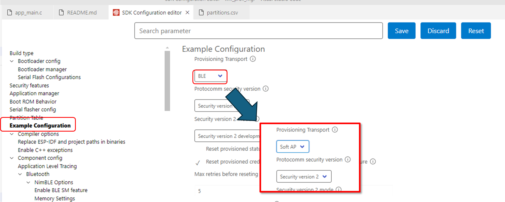

# การทดลองย่อยที่ 3

esp32 รุ่นที่ใช้งานกันนั้นสามารถใช้ได้ทั้ง WiFi และมี ble (ซึ่งใน esp32 บางรุ่นจะมีเฉพาะ WiFi เพียงอย่างเดียว)

ถ้าหากต้องการเรียนการ provision จาก ble ไปเป็น WiFi ก็สามารถทำได้โดยการเข้าไปที่ menuconfig และไปเลือก WiFi AP แทน ble


## 3.1 เปลี่ยนวิธีการทำ provision
1. เรียก menuconfig
2. เลือก Example Configuration
3. เปลี่ยน ble เป็น soft AP
4. คลิกปุ่ม save



5. build, flash. monitor

6. ติดตั้ง application ที่ใช้ทำการ provision เพิ่มเติมถ้าจำเป็น (application ที่ใช้ wifi และ ble ในการทำ provision จะเป็นคนละตัวกัน)
   
7. ทำการ provision จนสามารถเชื่อมต่อกับ access point ได้สำเร็จ
8. บันทึก log ทาง output ของ serial monitor พร้อมทั้งอธิบายส่วนที่สำคัญ
```
I (1126) app: If QR code is not visible, copy paste the below URL in a browser.
https://espressif.github.io/esp-jumpstart/qrcode.html?data={"ver":"v1","name":"PROV_0ED094","username":"wifiprov","pop":"abcd1234","transport":"softap"}
I (1786) wifi:new:<1,0>, old:<1,1>, ap:<1,1>, sta:<0,0>, prof:1, snd_ch_cfg:0x0
I (1786) wifi:station: 96:c7:50:11:11:3a join, AID=1, bgn, 20
I (1786) app: SoftAP transport: Connected!
I (1976) esp_netif_lwip: DHCP server assigned IP to a client, IP is: 192.168.4.2
I (2136) wifi:<ba-add>idx:2 (ifx:1, 96:c7:50:11:11:3a), tid:0, ssn:0, winSize:64
I (41616) wifi:station: 96:c7:50:11:11:3a leave, AID = 1, reason = 8, bss_flags is 33721459, bss:0x3ffcb520
I (41616) wifi:new:<1,0>, old:<1,0>, ap:<1,1>, sta:<0,0>, prof:1, snd_ch_cfg:0x0      
I (41626) wifi:<ba-del>idx:2, tid:0
I (41626) app: SoftAP transport: Disconnected!
I (50806) wifi:new:<1,0>, old:<1,0>, ap:<1,1>, sta:<0,0>, prof:1, snd_ch_cfg:0x0
I (50806) wifi:station: 96:c7:50:11:11:3a join, AID=1, bgn, 20
I (50806) app: SoftAP transport: Connected!
I (51016) esp_netif_lwip: DHCP server assigned IP to a client, IP is: 192.168.4.2
I (51246) wifi:<ba-add>idx:2 (ifx:1, 96:c7:50:11:11:3a), tid:0, ssn:0, winSize:64
I (56296) security2: Using salt and verifier to generate public key...
I (56806) app: Secured session established!
W (74806) wifi:Password length matches WPA2 standards, authmode threshold changes from OPEN to WPA2
I (74826) app: Received Wi-Fi credentials
        SSID     : AIS 4G Hi-Speed Home WiFi_76947550769475
        Password : 50769475
I (78926) wifi:primary chan differ, old=1, new=11, start CSA timer
I (79326) wifi:switch to channel 11
I (79326) wifi:ap channel adjust o:1,1 n:11,2
I (79326) wifi:new:<11,0>, old:<1,0>, ap:<11,2>, sta:<0,0>, prof:1, snd_ch_cfg:0x0
I (79336) wifi:new:<11,2>, old:<11,0>, ap:<11,2>, sta:<11,0>, prof:1, snd_ch_cfg:0x0  
I (79346) wifi:state: init -> auth (0xb0)
I (79346) wifi:state: auth -> assoc (0x0)
I (79366) wifi:state: assoc -> run (0x10)
I (79376) wifi:connected with AIS 4G Hi-Speed Home WiFi_769475, aid = 3, channel 11, BW20, bssid = 30:0a:c5:9e:94:9f
I (79386) wifi:security: WPA2-PSK, phy: bgn, rssi: -61
I (79396) wifi:pm start, type: 1

I (79396) wifi:dp: 1, bi: 102400, li: 3, scale listen interval from 307200 us to 307200 us
I (79406) wifi:<ba-add>idx:0 (ifx:0, 30:0a:c5:9e:94:9f), tid:0, ssn:2, winSize:64
I (79446) wifi:AP's beacon interval = 102400 us, DTIM period = 1
I (80406) app: Connected with IP Address:192.168.1.157
I (80406) esp_netif_handlers: sta ip: 192.168.1.157, mask: 255.255.255.0, gw: 192.168.1.1
I (80406) wifi_prov_mgr: STA Got IP
I (80416) app: Provisioning successful
I (80416) app: Hello World!
I (81416) app: Hello World!
I (82416) app: Hello World!
I (83416) app: Hello World!
I (84416) app: Hello World!
I (85416) app: Hello World!
I (86026) wifi:station: 96:c7:50:11:11:3a leave, AID = 1, reason = 4, bss_flags is 33721459, bss:0x3ffcb520
I (86026) wifi:new:<11,0>, old:<11,2>, ap:<11,2>, sta:<11,0>, prof:1, snd_ch_cfg:0x0
I (86026) wifi:<ba-del>idx:2, tid:0
I (86036) wifi:mode : sta (24:d7:eb:0e:d0:94)
I (86046) wifi_prov_mgr: Provisioning stopped
I (86046) app: SoftAP transport: Disconnected!
I (86416) app: Hello World!
```

9. ส่งขึ้น github
